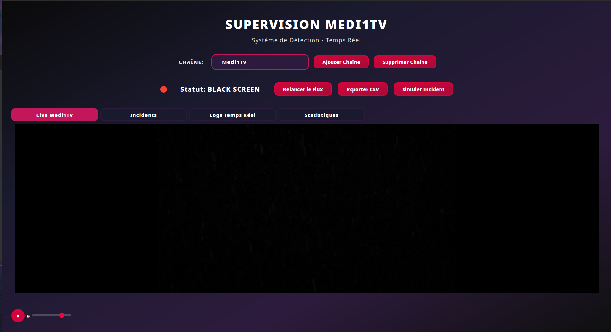
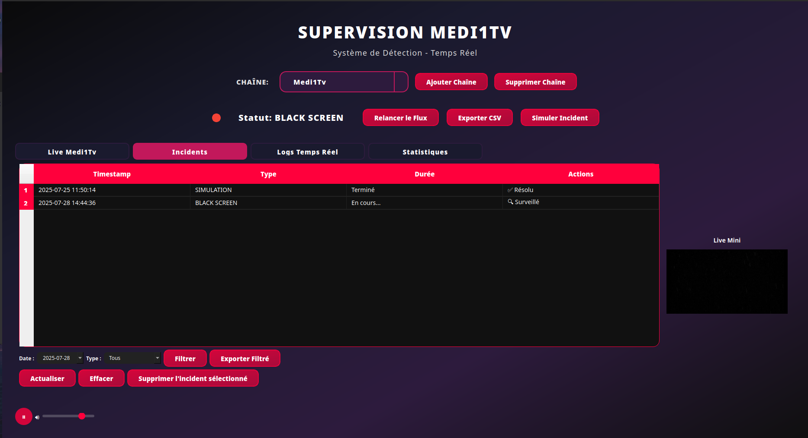
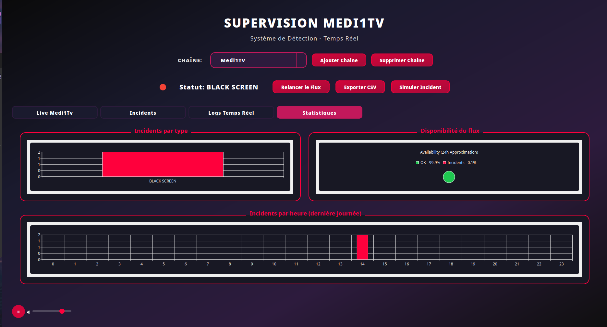

# SupervisionBroadcast

A real-time broadcast monitoring and incident detection system built with Python and PyQt5. This application provides comprehensive monitoring of video streams with automatic incident detection, logging, and statistical analysis.

## Features

- **Real-time Stream Monitoring**: Monitor multiple video streams simultaneously
- **Incident Detection**: Automatic detection of black screens, frozen frames, audio silence, and content issues
- **Content Moderation**: AI-powered NSFW content detection and forbidden text recognition
- **Live Statistics**: Real-time charts and analytics for stream health monitoring
- **Incident Logging**: Comprehensive logging system with export capabilities
- **Multi-channel Support**: Manage and monitor multiple broadcast channels
- **Modern UI**: Glassmorphism design with intuitive user interface

## Screenshots

### Live Stream Monitoring


### Incident Management


### Real-time Logs


### Statistics Dashboard


## Installation

### Prerequisites

- Python 3.8 or higher
- VLC Media Player
- FFmpeg

### Setup

1. Clone the repository:
```bash
git clone https://github.com/yourusername/SupervisionBroadcast.git
cd SupervisionBroadcast
```

2. Create a virtual environment:
```bash
python3 -m venv venv
source venv/bin/activate  # On Windows: venv\Scripts\activate
```

3. Install dependencies:
```bash
pip install -r requirements.txt
```

4. Configure channels:
Edit `channels.json` to add your stream URLs:
```json
[
    {
        "name": "Your Channel",
        "url": "https://your-stream-url.com/stream.m3u8",
        "db_name": "incidents_your_channel.db"
    }
]
```

## Usage

### Quick Start

Run the application:
```bash
python3 main.py
```

Or use the provided script:
```bash
./lancer_supervision.sh
```

### Adding Channels

1. Click "Add Channel" in the interface
2. Enter channel name and M3U8 stream URL
3. The system will automatically create monitoring for the new channel

### Monitoring Features

- **Live Tab**: Real-time video stream display
- **Incidents Tab**: View and manage detected incidents
- **Logs Tab**: Real-time monitoring logs
- **Statistics Tab**: Analytics and performance metrics

### Incident Types Detected

- **Black Screen**: Detects when video stream shows black screen
- **Frozen Frame**: Identifies when video stream is frozen
- **Audio Silence**: Detects extended periods of audio silence
- **Content Issues**: AI-powered inappropriate content detection
- **Forbidden Text**: Recognizes unauthorized text overlays
- **Connection Errors**: Monitors stream accessibility issues

## Configuration

### Channel Management

Channels are configured in `channels.json`:
```json
{
    "name": "Channel Name",
    "url": "M3U8 Stream URL",
    "db_name": "incidents_channel_name.db"
}
```

### Content Moderation

The system includes AI-powered content moderation:
- NSFW content detection using NudeNet
- Forbidden text recognition using OCR
- Unauthorized logo detection

## Data Export

Incidents can be exported in multiple formats:
- CSV export for spreadsheet analysis
- Real-time logging to text files
- Statistical reports with charts

## Development

### Project Structure

```
SupervisionBroadcast/
├── main.py                 # Application entry point
├── gui.py                  # Main GUI implementation
├── stream_monitor.py       # Stream monitoring engine
├── incident_ai.py          # AI incident analysis
├── content_moderation.py   # Content moderation system
├── channels.json           # Channel configuration
├── requirements.txt        # Python dependencies
├── data/                   # Incident databases
├── assets/                 # Application assets
└── Screenshots/           # Application screenshots
```

### Key Components

- **StreamMonitor**: Handles real-time stream analysis
- **MainWindow**: PyQt5-based user interface
- **ContentModeration**: AI-powered content analysis
- **IncidentAI**: Intelligent incident recommendations

## Building Executable

To create a standalone executable:

```bash
python3 build_exe.py
```

The executable will be created in the `dist/` directory.

## Troubleshooting

### Common Issues

1. **VLC Not Found**: Ensure VLC Media Player is installed
2. **Stream Connection**: Verify stream URLs are accessible
3. **Permission Errors**: Check file permissions for data directory

### Log Files

- `stream_events_*.log`: Channel-specific monitoring logs
- `crash.log`: Application crash reports
- `vlc_debug.log`: VLC player debugging information

## License

This project is licensed under the MIT License - see the [LICENSE](LICENSE) file for details.

## Author

**Zakariae El Bouzidi**

## Acknowledgments

- PyQt5 for the user interface
- VLC for video stream handling
- OpenCV for image processing
- NudeNet for content moderation
- Matplotlib for statistical visualization # Broadcast-Supervision
